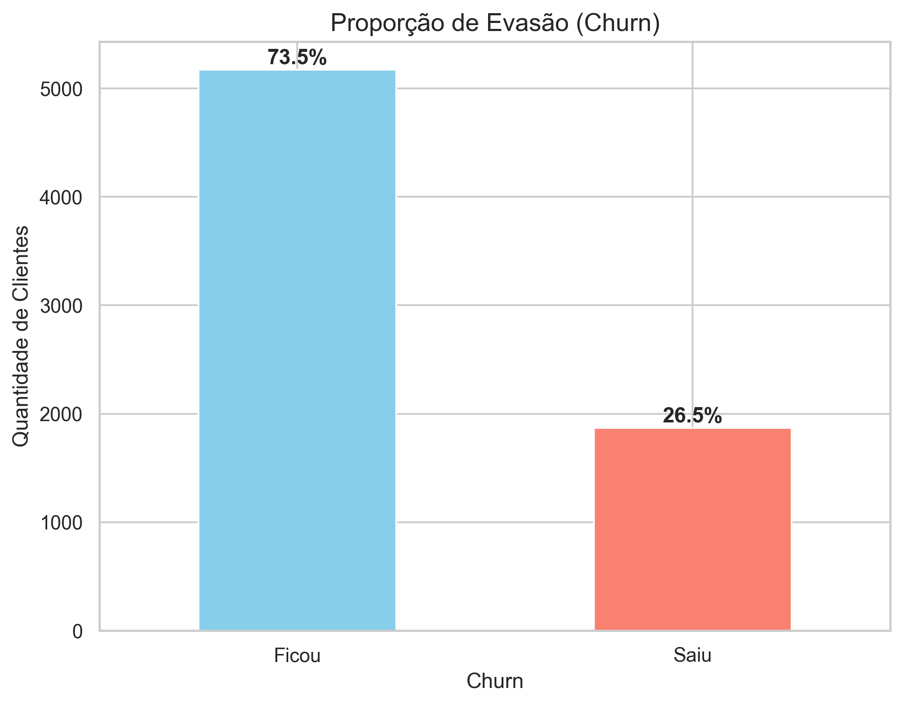
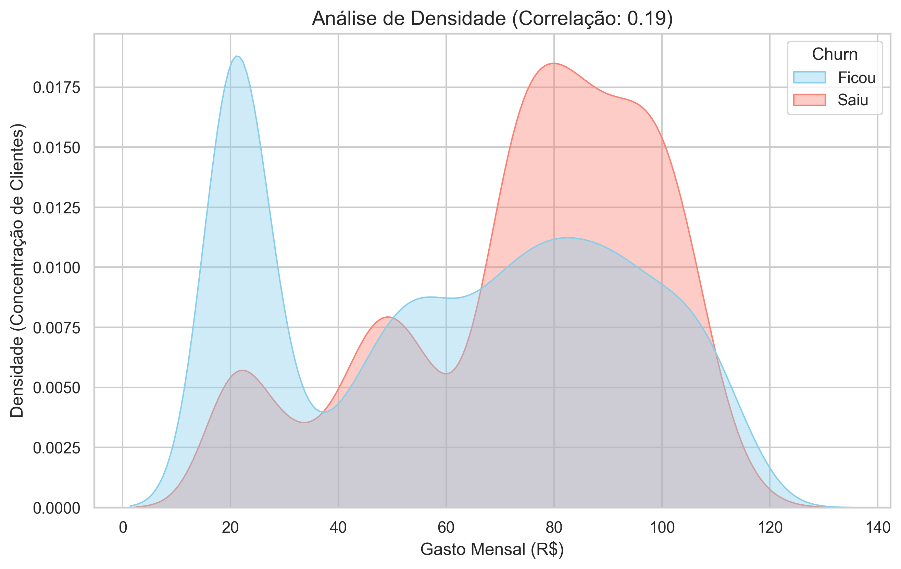
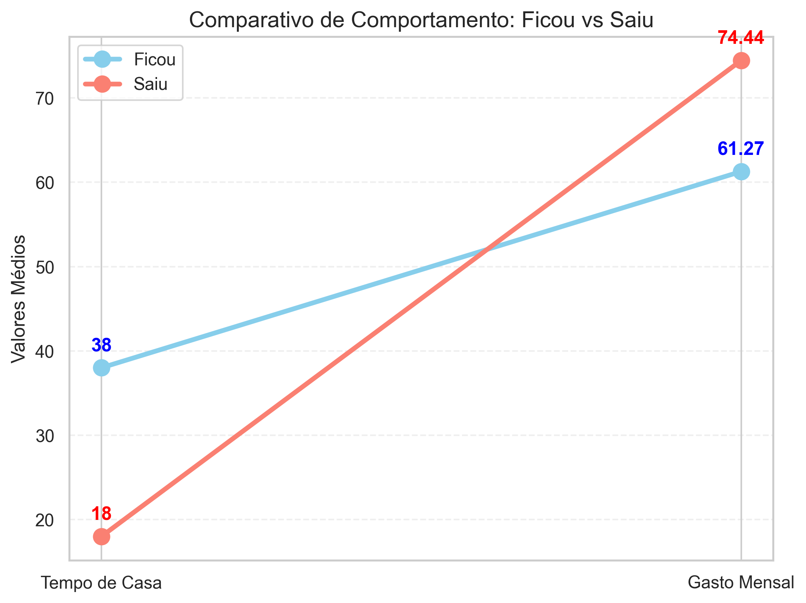

# 📉 Análise de Retenção e Churn: TelecomX

## 📝 Sobre o Projeto

Este projeto analisa os dados de cancelamento (churn) da TelecomX. O objetivo é identificar os fatores que levam o cliente a abandonar o serviço e fornecer embasamento estratégico para reduzir a evasão e proteger a receita da empresa.

## 📊 Análise dos Indicadores

### 🚩 1. Panorama Geral de Evasão

Atualmente, enfrentamos uma taxa de churn de **26,5%**. Este indicador é o ponto de partida que justifica as ações urgentes de retenção.

### 💸 2. Sensibilidade ao Preço (Ticket Médio)

Identificamos que a "barreira de saída" é baixa para faturas entre **R$ 70,00 e R$ 110,00**. Clientes com contas mais altas são os primeiros a abandonar a rede.

### ⚔️ 3. O "X" da Questão: Tempo vs. Gasto

Clientes que evadem permanecem apenas **18 meses** na base, pagando um ticket médio elevado de **R$ 74,44**. Em contraste, clientes fiéis ficam **38 meses** com faturas de **R$ 61,27**.

### 🔗 4. Correlação de Variáveis

Análise estatística que comprova: quanto maior o tempo de casa (`tenure`), menor a chance de churn, atuando como um escudo natural do negócio.

---

## 🤖 Parte 2: Inteligência Artificial e Predição

Nesta etapa, desenvolvemos modelos de Machine Learning para prever o comportamento dos clientes e automatizar a identificação de riscos.

### 🏆 Desempenho dos Modelos

Avaliamos diferentes algoritmos para encontrar a melhor precisão. O modelo **Random Forest** consolidou-se como a melhor solução, atingindo uma acurácia de **87,34%**, demonstrando excelente capacidade de generalização para novos dados.

### 🔍 O que a IA aprendeu? (Principais Motivos de Churn)

A análise de importância das variáveis revelou os 3 fatores decisivos que motivam o cancelamento:

1. **Tipo de Contrato:** Clientes com contratos mensais (sem fidelidade) são os que mais saem.
2. **Gasto Mensal:** O valor da fatura é um gatilho crítico para a decisão de cancelamento.
3. **Meses de Contrato (Tenure):** O risco é máximo no início da relação e diminui à medida que o cliente ganha tempo de casa.

---

## 💡 Conclusão Final

Recomendamos a **fidelização agressiva no 1º ano** e a **migração forçada de contratos mensais para anuais**. O foco deve ser o cliente de ticket alto nos primeiros 18 meses, onde o risco de perda é máximo. Com o modelo de **Random Forest**, a empresa pode agora agir preventivamente em 87% dos casos potenciais.

## 🛠️ Tecnologias Utilizadas
* **Python** 🐍 (Linguagem principal)
* **Pandas** 🐼 (Manipulação e tratamento de dados)
* **JSON** 📄 (Leitura e processamento de dados brutos)
* **Scikit-Learn** 🤖 (Machine Learning: Naive Bayes, Random Forest e métricas)
* **Imbalanced-learn (SMOTE)** ⚖️ (Balanceamento da base de dados)
* **Matplotlib & Seaborn** 📊 (Visualização de dados e matrizes de confusão)
* **Warnings** ⚠️ (Gerenciamento e limpeza de alertas do sistema)
* **VS Code** 💻 (Ambiente de desenvolvimento)

---

## 👩‍💻 Autoria
**Camila Monteiro Rondon** *Estudante de Data Science* 🚀 Integrante do programa **Alura + Oracle Next Education (ONE)**